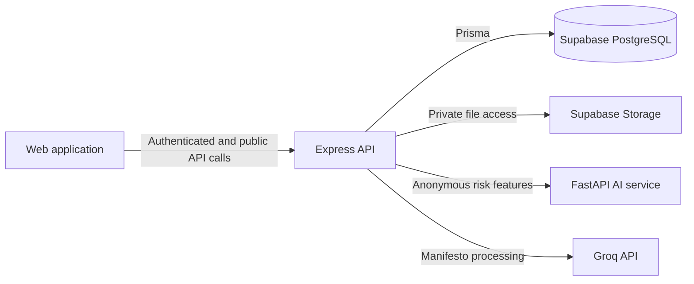

# Quorum

Quorum is a privacy-focused university election platform for managing the complete election lifecycle: ballot creation, student nominations, candidate review, manifesto comparison, voter verification, anonymous voting, anomaly review, result publication, receipt verification, and runoff elections.

[Live demonstration](https://university-voting-platform-web.vercel.app)

This repository contains a full-stack interactive prototype. It demonstrates the application workflow and privacy architecture; additional independent security and operational review would be required before use in a real election.

## Core capabilities

- Unified student and administrator sign-in with role-based access.
- Global, departmental, class-year, club, and combined eligibility rules.
- Student ballot notifications and nomination tracking.
- Administrator nomination approval and rejection workflows.
- Manifesto highlights and topic-based candidate comparison.
- Browser-based face and presence verification.
- Candidate voting restrictions for ballots in which they are standing.
- Blind-signature voting authorization and credential-free vote submission.
- SHA-256 voting receipts with public verification.
- Privacy-preserving anomaly scoring and administrator review.
- Frozen result publication, exact-tie detection, and runoff creation.
- Responsive student, administrator, and public interfaces.

## Architecture



| Layer | Technology | Responsibility |
| --- | --- | --- |
| Web application | TypeScript, React, Next.js-compatible App Router, Vinext, Tailwind CSS | Student, administrator, and public experiences |
| Core API | Node.js, Express, TypeScript, Zod | Authentication, ballots, nominations, voting, receipts, and administration |
| Data access | Prisma ORM, PostgreSQL | Typed persistence for election and voting records |
| Database and storage | Supabase | PostgreSQL hosting and private profile-photo storage |
| AI service | Python, FastAPI, scikit-learn | Isolation Forest anomaly assessment |
| Manifesto intelligence | Groq SDK | Grounded manifesto highlights and comparison topics |
| Shared contracts | TypeScript workspace package | Domain types and API contracts shared by the web and API applications |

## Repository structure

```text
quorum/
├── apps/
│   ├── web/                 # Student, administrator, and public interface
│   ├── express-api/         # Authentication and election API
│   └── ai-service/          # FastAPI anomaly-scoring service
├── packages/
│   └── shared/              # Shared TypeScript contracts
├── supabase/                # Supabase configuration and SQL migrations
├── scripts/                 # Database and build utilities
└── tests/                   # Browser, bot, and load-testing resources
```

## Privacy model

Election data is organized across five core tables:

- `students`
- `ballots`
- `candidates`
- `voter_logs`
- `vote_hashes`

`voter_logs` records that a student received a one-time voting authorization. `vote_hashes` stores the anonymous vote, receipt, token digest, and coarse anomaly features. There is no student identifier or foreign key connecting an anonymous vote to a student.

The anonymous vote record does not store the student ID, JWT, session, raw IP address, full user-agent string, raw vote token, or blind signature. A receipt confirms that an anonymous ballot was recorded without revealing the voter or candidate choice.

## Prerequisites

Install the following before running Quorum locally:

- Node.js 22.13 or later
- npm
- Python 3.11 or later
- A Supabase project
- A Groq API key for manifesto processing
- Git and VS Code are recommended for development
- k6 is optional and is needed only for staging load tests

## Local setup

### 1. Install JavaScript dependencies

From the repository root (`UVP/quorum`):

```bash
npm install
```

### 2. Create the environment files

Copy each example file to `.env` in the same directory:

```powershell
Copy-Item apps/web/.env.example apps/web/.env
Copy-Item apps/express-api/.env.example apps/express-api/.env
Copy-Item apps/ai-service/.env.example apps/ai-service/.env
```

If these files already exist, keep them and update only the missing values.

The API environment requires the following private values:

```dotenv
SUPABASE_URL=your_supabase_project_url
SUPABASE_SECRET_KEY=your_supabase_secret_key
DATABASE_URL=your_pooled_postgresql_connection
DIRECT_URL=your_direct_postgresql_connection
JWT_SECRET=use_a_long_random_local_secret
GROQ_API_KEY=your_groq_api_key
```

Do not commit `.env` files, database passwords, Supabase secret keys, JWT secrets, Groq keys, or signing-key material.

### 3. Configure local accounts

Choose development credentials in `apps/express-api/.env`:

```dotenv
SEED_STUDENT_PASSWORD=choose_a_local_student_password
DEV_ADMIN_NAME=Election Administrator
DEV_ADMIN_EMAIL=admin@quorum.edu
DEV_ADMIN_PASSWORD=choose_a_local_admin_password
```

Use separate values for local development and hosted environments. Never publish or commit working administrator or student passwords.

### 4. Prepare the Python service

```powershell
python -m venv apps/ai-service/.venv
.\apps\ai-service\.venv\Scripts\Activate.ps1
python -m pip install -r apps/ai-service/requirements.txt
```

### 5. Prepare the database

Validate and apply the database migration:

```bash
npm run db:validate
npm run db:push:dry-run
npm run db:push
npm run db:verify
```

Generate the Prisma client and seed the development students:

```bash
npm run prisma:generate --workspace @quorum/express-api
npm run db:seed --workspace @quorum/express-api
```

The seed process hashes `SEED_STUDENT_PASSWORD` with Argon2id before storing it. It also creates the private `profile-photos` bucket when needed and uploads the development profile photo.

## Development accounts

The seed script creates the following representative accounts. Their passwords are supplied through environment variables and are not stored in this repository.

| Role | Name | Sign-in identifier | Password source | Suggested use |
| --- | --- | --- | --- | --- |
| Administrator | Election Administrator | `admin@quorum.edu` | `DEV_ADMIN_PASSWORD` | Create ballots, review nominations and anomalies, publish results, and create runoffs |
| Student | Nada Alahmad | `20260001` or `nada.alahmad@quorum.edu` | `SEED_STUDENT_PASSWORD` | Submit and track a nomination |
| Student | Maya Khalil | `20260002` or `maya.khalil@quorum.edu` | `SEED_STUDENT_PASSWORD` | Submit a second nomination for comparison |
| Student | Omar Haddad | `20260003` or `omar.haddad@quorum.edu` | `SEED_STUDENT_PASSWORD` | Vote in a ballot where the account is not a candidate |

Student passwords are hashed with Argon2id before storage. Credentials for the hosted demonstration are available privately on request.

## Run the platform

Open three terminals at the repository root.

Terminal 1 — FastAPI service:

```powershell
.\apps\ai-service\.venv\Scripts\python.exe -m uvicorn app.main:app --app-dir apps/ai-service --reload --port 8000
```

Terminal 2 — Express API:

```bash
npm run dev:api
```

Terminal 3 — web application:

```bash
npm run dev:web
```

Local services:

| Service | Address |
| --- | --- |
| Web application | `http://localhost:5173` |
| Express API | `http://localhost:4000` |
| FastAPI service | `http://localhost:8000` |
| FastAPI documentation | `http://localhost:8000/docs` |

## Recommended demonstration

1. Sign in as the administrator and post a ballot.
2. Sign in as Nada and submit a nomination.
3. Sign in as Maya and submit a second nomination.
4. Return to the administrator account and approve both nominations.
5. Sign in as Omar, compare the two manifestos, complete the face check, and cast a vote.
6. Verify the returned receipt through the public ledger.
7. Review any flagged votes, close the ballot, and publish the result.
8. If the leading candidates are tied, create a runoff ballot from the tally workspace.

A candidate cannot vote in a ballot in which they are standing, but may vote in other eligible ballots.

## Common commands

| Command | Purpose |
| --- | --- |
| `npm run dev:web` | Start the web application |
| `npm run dev:api` | Start the Express API |
| `npm run dev:ai` | Start the FastAPI service |
| `npm run build` | Build the API and web application |
| `npm run typecheck` | Run workspace TypeScript checks |
| `npm run db:validate` | Validate the SQL migration in a rolled-back transaction |
| `npm run db:push:dry-run` | Preview database migration changes |
| `npm run db:push` | Apply database migrations |
| `npm run db:verify` | Verify the expected database structure |
| `npm run test:voting` | Run blind-voting, receipt, tally, anomaly, and manifesto tests |
| `npm run test:ai` | Run FastAPI service tests |
| `npm run test:bot` | Run the browser-based high-velocity voting test |
| `npm run test:load` | Run the k6 load test against a staging environment you control |

`test:bot` requires the web, API, and AI services to be running. `test:load` requires the k6 CLI. Never run the load test against a live production election.

## Security and production readiness

Quorum currently provides a complete full-stack prototype. Before real election use, the deployment requires:

- Independent review of the blind-signature protocol and key management.
- Production-grade biometric liveness protection and a documented consent and privacy policy.
- Penetration testing and dependency auditing.
- Privacy, retention, logging, and infrastructure-access reviews.
- Managed secrets and signing keys.
- Monitoring, backup, disaster-recovery, and incident-response procedures.
- Accessibility, browser, load, and end-to-end acceptance testing.

Do not describe the system as providing absolute or guaranteed anonymity. Blind signatures protect the unlinkability of voting authorization from the submitted vote, while production privacy also depends on network metadata, logging, timing, infrastructure, and operational controls.

## License

This project is intended for academic development, evaluation, and portfolio demonstration. No open-source license has currently been assigned.
